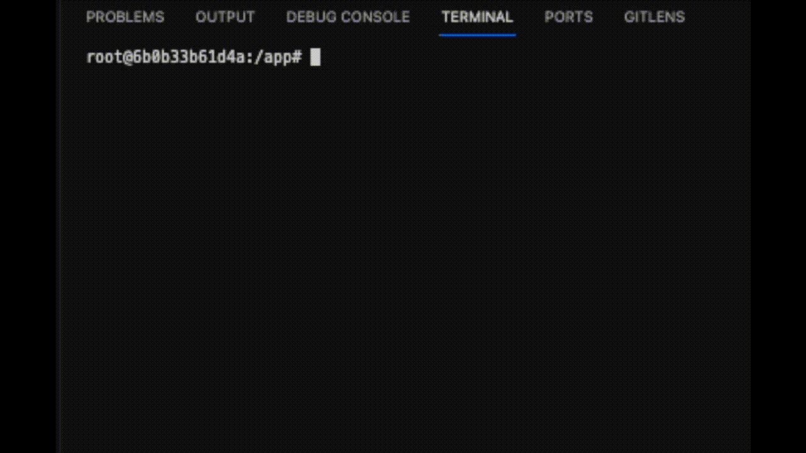

# Interactive mode
## Using Shell Commands in Julia
Type `;` to enter shell mode. Then you can run shell commands. For example, to list the files in the current directory, type `ls`. 

## Leaving Shell Mode
Press backspace to leave shell mode.

## Leaving Julia
Type `exit()` to leave Julia.

## Demo
